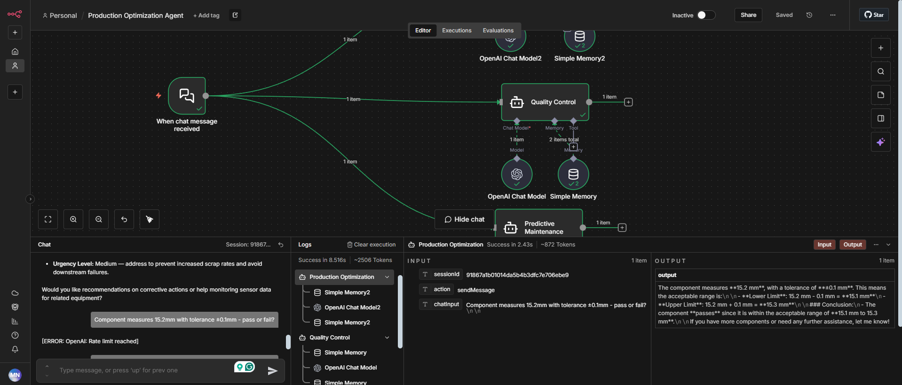

# AI Agents Assignment & AutoParts Inc. Multi-Agent Solution

## Overview

This project demonstrates the implementation of a multi-agent AI system designed for manufacturing automation using n8n workflow automation. The system addresses key challenges at AutoParts Inc., including high defect rates, machine downtime, and production inefficiencies.

---

# Part 1: AI Agents Assignment – Smart Manufacturing Implementation

## What I Built

Three specialized AI agents working together in a coordinated workflow.

### 1. Quality Control Agent

**Role:** Inspect parts and determine PASS/FAIL
**Example Query:** "Component measures 15.2mm with tolerance ±0.1mm - pass or fail?"

### 2. Predictive Maintenance Agent

**Role:** Monitor machine sensor data and predict failures
**Example Query:** "Machine vibration 8.5, temperature 85°C - maintenance needed?"

### 3. Production Optimization Agent

**Role:** Schedule production and allocate resources
**Example Query:** "3 custom orders due Friday, only 2 machines available - schedule?"

---

## Technical Implementation

* **Platform:** n8n workflow automation
* **AI Model:** OpenAI GPT-4
* **Architecture:** Chat Trigger → Three parallel agents
* **Key Features:** Agent memory, specialized prompts, real-time decision workflows

---

## Expected Results

* 40–60% reduction in defect rates
* 50–70% reduction in machine downtime
* 20–35% reduction in labor costs
* 300–500% expected ROI within 12–18 months

---

## Implementation Timeline

* **Months 1–6:** Pilot phase with Quality Control and Predictive Maintenance agents
* **Months 7–12:** Full rollout across facility
* **Year 2+:** System optimization and continuous improvement

---

# Part 2: Theoretical Foundations

## 1. LangChain vs AutoGen

* **LangChain:** Suitable for linear, single-agent workflows
* **AutoGen:** Designed for multi-agent dialogues and collaboration
* **Chosen Tool:** n8n for visual workflow orchestration

## 2. AI in Supply Chains

AI agents automate inventory and delivery routing, improving reliability and responsiveness.

## 3. Human-Agent Teamwork

AI automates data-heavy tasks, enabling humans to focus on analysis and strategic decisions.

## 4. Ethical Considerations

Financial and operational AI require transparency, bias prevention, and human oversight.

## 5. Memory Challenges

AI systems depend on reliable memory storage to track previous inputs and maintain context.

---

# Part 3: AutoParts Inc. Case Study

## Core Challenges

* 15% defect rate in precision components
* Frequent and unpredictable machine failures
* High labor costs and skilled worker shortages
* Increasing demand for customization and faster delivery

---

# A Multi-Agent Solution for AutoParts Inc.

## Agent Types and Their Roles

| Agent Type               | Primary Role                        | Capabilities                                                                                                         |
| ------------------------ | ----------------------------------- | -------------------------------------------------------------------------------------------------------------------- |
| Goal-Based Agent         | Quality Control: Reduce defect rate | Uses computer vision to inspect parts, identify imperfections, and flag defective components in real time            |
| Model-Based Reflex Agent | Predictive Maintenance              | Analyzes sensor data such as vibration and temperature to predict failures and schedule maintenance                  |
| Utility-Based Agent      | Production Optimization             | Optimizes production schedules, allocates resources, balances lines, and evaluates cost, energy usage, and deadlines |

---

# ROI and Implementation Strategy

## Phased Implementation

### Phase 1: Months 1–6

Pilot the Predictive Maintenance and Quality Control agents on critical machines and high-defect lines.

### Phase 2: Months 7–12

Scale across additional production lines and integrate the Utility-Based Production Agent.

### Phase 3: Year 2+

Full system integration with potential learning agents for continuous optimization.

---

## Quantitative Benefits

### Short-Term (3–6 months)

* Initial efficiency gains of 5–15%
* Reduced manual monitoring
* 15–30% initial investment recovery

### Mid-Term (6–12 months)

* 40–60% reduction in defects
* 50–70% decrease in machine downtime
* 20–35% reduction in labor and scheduling costs

### Long-Term (12+ months)

* 300–500% ROI
* Fully optimized production flows
* Profitable handling of customization at scale

---

## Qualitative Benefits

* Stronger competitive position
* Workforce upskilling and improved satisfaction
* Data-driven culture with improved decision-making

---

# Risks and Mitigation

## Technical Risks

**Challenge:** Legacy machinery and inconsistent data
**Mitigation:** Use n8n connectors, phased rollout, and data cleansing

## Organizational Risks

**Challenge:** Worker resistance or fear of automation
**Mitigation:** Training programs, involvement in design, clear communication that AI augments human roles

## Ethical and Safety Risks

**Challenge:** Opaque AI decisions and privacy concerns
**Mitigation:** Human-in-the-loop guardrails and clear accountability structures

---

# n8n Screenshots Overview

```markdown



```

---

# Live Demo

Ask for an invite to view the project:
[https://macymacy.app.n8n.cloud/workflow/K9svQMFt0W5UHn2d](https://macymacy.app.n8n.cloud/workflow/K9svQMFt0W5UHn2d)


